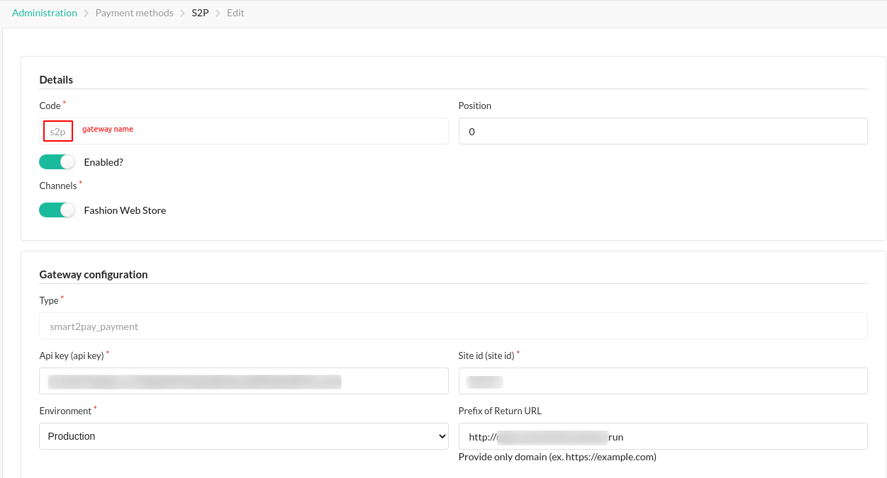

# Plugin Documentation

## Instalation

```bash
composer install bpolnet/sylius-smart2pay-plugin
```

Add plugin dependencies to your `config/bundles.php` file:

```php
return [
    BPolNet\SyliusSmart2PayPlugin\BPolNetSyliusSmart2PayPlugin::class
];
```

## Configuration

1. Create an Smart2Pay account.

2. Add a new REST Site. Notification URL later will be configured later.

   

3. Add and configure Smart2Pay payment method in Sylius.

   

    - provide api_key (nr 4 on the previous screen)
    - provide site_id (nr 3 on the previous screen)
    - select Environment: production or sandbox
    - you can customize Return URL. Used only when developing.

4. Configure Notification URL in Smart2Pay (see Smart2Pay image).
    - provide notification URL as: https://your_domain.com/payments/notify/unsafe/{gateway_name}
    - `{gateway_name}` is the same as the code of payment method (see Sylius image).


# Sylius Documentation

## Documentation

For a comprehensive guide on Sylius Plugins development please go to Sylius documentation,
there you will find the <a href="https://docs.sylius.com/en/latest/plugin-development-guide/index.html">Plugin Development Guide</a>, that is full of examples.

## Quickstart Installation

1. Run `composer create-project sylius/plugin-skeleton ProjectName`.

2. From the plugin skeleton root directory, run the following commands:

    ```bash
    $ (cd tests/Application && yarn install)
    $ (cd tests/Application && yarn build)
    $ (cd tests/Application && APP_ENV=test bin/console assets:install public)
    
    $ (cd tests/Application && APP_ENV=test bin/console doctrine:database:create)
    $ (cd tests/Application && APP_ENV=test bin/console doctrine:schema:create)
    ```

To be able to setup a plugin's database, remember to configure you database credentials in `tests/Application/.env` and `tests/Application/.env.test`.

## Usage

### Running plugin tests

  - PHPUnit

    ```bash
    vendor/bin/phpunit
    ```

  - PHPSpec

    ```bash
    vendor/bin/phpspec run
    ```

  - Behat (non-JS scenarios)

    ```bash
    vendor/bin/behat --strict --tags="~@javascript"
    ```

  - Behat (JS scenarios)
 
    1. [Install Symfony CLI command](https://symfony.com/download).
 
    2. Start Headless Chrome:
    
      ```bash
      google-chrome-stable --enable-automation --disable-background-networking --no-default-browser-check --no-first-run --disable-popup-blocking --disable-default-apps --allow-insecure-localhost --disable-translate --disable-extensions --no-sandbox --enable-features=Metal --headless --remote-debugging-port=9222 --window-size=2880,1800 --proxy-server='direct://' --proxy-bypass-list='*' http://127.0.0.1
      ```
    
    3. Install SSL certificates (only once needed) and run test application's webserver on `127.0.0.1:8080`:
    
      ```bash
      symfony server:ca:install
      APP_ENV=test symfony server:start --port=8080 --dir=tests/Application/public --daemon
      ```
    
    4. Run Behat:
    
      ```bash
      vendor/bin/behat --strict --tags="@javascript"
      ```
    
  - Static Analysis
  
    - Psalm
    
      ```bash
      vendor/bin/psalm
      ```
      
    - PHPStan
    
      ```bash
      vendor/bin/phpstan analyse -c phpstan.neon -l max src/  
      ```

  - Coding Standard
  
    ```bash
    vendor/bin/ecs check src
    ```

### Opening Sylius with your plugin

- Using `test` environment:

    ```bash
    (cd tests/Application && APP_ENV=test bin/console sylius:fixtures:load)
    (cd tests/Application && APP_ENV=test bin/console server:run -d public)
    ```
    
- Using `dev` environment:

    ```bash
    (cd tests/Application && APP_ENV=dev bin/console sylius:fixtures:load)
    (cd tests/Application && APP_ENV=dev bin/console server:run -d public)
    ```
